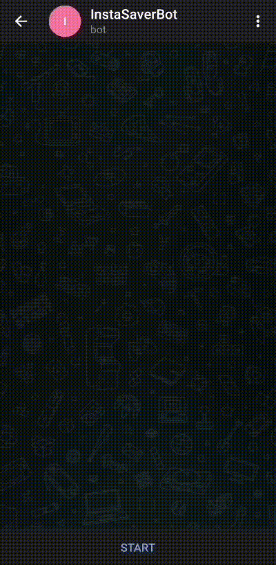

# Instagram Media Saver Bot
InstaMediaSaver_bot is a telegram bot that helps to download profile pictures of both public and private accounts with profile details 

As you may know, we cannot enlarge  the profile picture of instagram accounts ,this bot helps you  to view  it in your comfort <br>

Deployed Telegram bot username **@InstaMediaSaver_bot**

## Demo



## Installation
Download the source code or clone it using <br>
```
https://github.com/Jayasankar-JN/InstagramBot.git
```

Change to InstagramBot directory<br>
```
cd InstagramBot
```

Create a virtual enviornment <br>
# Creating virtual environment in Linux
```
pip install virtualenv
```
```
 virtualenv virtualenv_name
```
```
source virtualenv_name/bin/activate
```
# Creating virtual environment in  Windows
```
pip install virtualenv
```
```
 virtualenv virtualenv_name
```
```
 virtualenv_name\Scripts\activate
 ```
 Install the required libraries using virtualenv<br>
 ```
 pip install -r requirements.txt
 ```

<br>

To make your own bot, you need to obtain an api token from [@BotFather](https://telegram.me/BotFather). Follow the instructions [here](https://core.telegram.org/bots#6-botfather) and obtain the same.


<br>
Now you are all set to run your bot. Enter the following commands in the terminal

<br>
```
python bot.py
```

Your bot is now all set to receive instructions.<br>

Will add new features soon.....!!!

